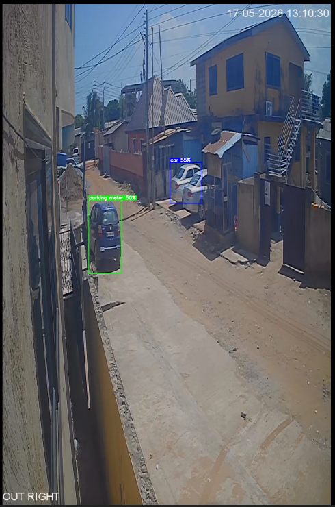
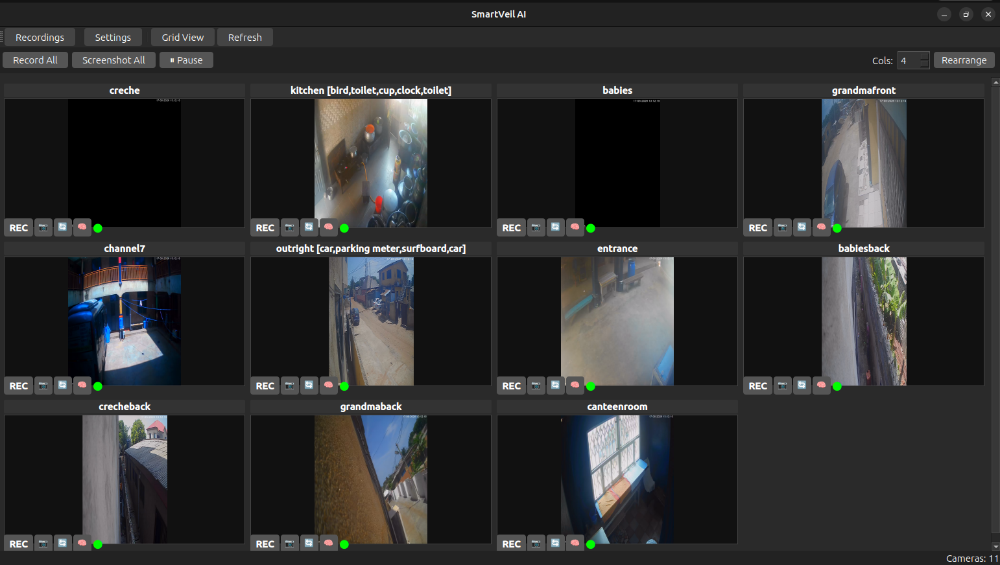
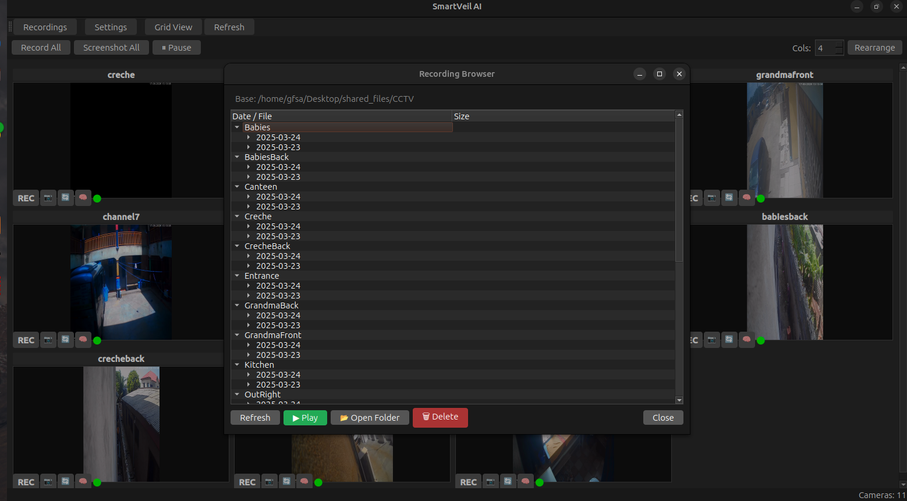
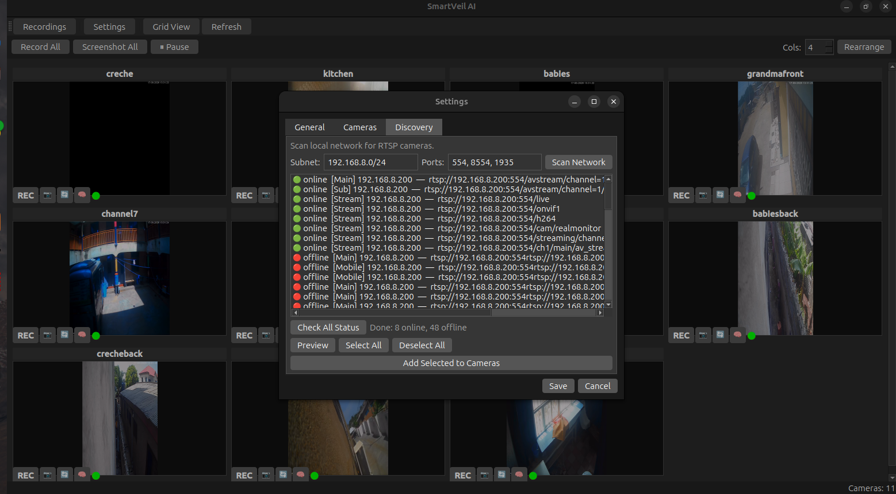

<p align="center">
  
  
  
  <a href="LICENSE"></a>
</p>

<h1 align="center">SmartVeil AI</h1>

<p align="center">
  Intelligent CCTV surveillance with real-time AI object detection, motion detection, RTSP recording, and auto-discovery.
</p>

---

## Features

- **Live grid view** — Watch all cameras simultaneously with auto-layout and drag-to-rearrange
- **AI object detection** — YOLOv8 detects people, vehicles, animals, and 80+ object classes with colored bounding boxes
- **Motion detection** — Real-time background subtraction with red highlight boxes
- **RTSP recording** — Segmented recording via ffmpeg with per-camera control
- **Network discovery** — Auto-scan local subnet for RTSP cameras on multiple ports
- **Stream quality** — Automatically finds Main, Sub, and Mobile streams for each channel
- **Zoom & pan** — Mouse wheel zoom (Ctrl+wheel in grid, wheel in expanded view), click-drag to pan
- **Screenshot capture** — Snapshot any camera instantly, saved to `~/Pictures/SmartVeil/`
- **Channel management** — Add, edit, rename, or remove cameras via Settings
- **Drag-to-rearrange** — Reorder cameras in the grid by dragging
- **Fullscreen mode** — Press F11 for immersive viewing
- **Recording browser** — Browse, play, and delete recorded footage
- **Persistent config** — All settings saved to `config.ini`

## Quick Start

### Linux / Raspberry Pi

```bash
git clone https://github.com/emantey21/SmartVeil-AI.git
cd SmartVeil-AI
./run.sh app
```

The first run will create a virtual environment and install dependencies automatically.

### Windows

```batch
git clone https://github.com/emantey21/SmartVeil-AI.git
cd SmartVeil-AI
python -m venv venv
venv\Scripts\activate
pip install -r requirements.txt
python main.py app
```

### Manual install

```bash
pip install -r requirements.txt
python main.py app
```

## Commands

| Command | Action |
|---------|--------|
| `python main.py app` | Launch the desktop GUI |
| `python main.py view <channel>` | View a single camera via ffplay |
| `python main.py view --grid` | View all cameras in a grid (OpenCV) |
| `python main.py record` | Record all channels via ffmpeg (headless) |
| `python main.py channels` | List configured cameras |
| `python main.py status` | Show recording status |

## AI Features

### Object Detection (🧠)

Powered by YOLOv8n — detects 80+ object classes in real-time:

| Color | Category | Examples |
|-------|----------|---------|
| 🔴 Red | People | person |
| 🔵 Blue | Vehicles | car, truck, bus, motorcycle, bicycle |
| 🟢 Green | Objects | dog, cat, laptop, chair, cell phone |

- Click the **🧠** button on any camera to enable
- Label shows object name and confidence percentage
- Runs every 5th frame to balance CPU usage
- All cameras share a single YOLO model (memory efficient)

### Motion Detection (🔄)

- Click the **🔄** button to enable
- Red boxes appear around moving regions
- Runs on every frame — very lightweight
- Status dot turns orange when motion is detected

## Configuration

### config.ini

```ini
[settings]
base_dir = /path/to/recordings
segment_time = 600
rtsp_transport = tcp
max_fps = 10

[channels]
Canteen = rtsp://192.168.8.200:554/avstream/channel=1/stream=0.sdp
Entrance = rtsp://192.168.8.200:554/avstream/channel=9/stream=0.sdp
```

### Settings GUI

**Toolbar → Settings** provides a graphical interface for all configuration:

- **General tab** — Change base directory, segment time, RTSP transport, max FPS
- **Cameras tab** — Add, edit, rename, or remove cameras
- **Discovery tab** — Auto-scan your network for RTSP cameras

### Network Discovery

1. Go to **Settings → Discovery**
2. Enter your subnet (e.g. `192.168.8.0/24`) and ports (e.g. `554, 8554, 1935`)
3. Click **Scan Network**
4. Select discovered cameras and click **Add Selected to Cameras**
5. Click **Check All Status** to verify which cameras are online
6. Click **Save** to persist changes

Discovery automatically extracts URL patterns from your existing cameras to find all available channels and stream qualities.

## Keyboard Shortcuts

| Key | Action |
|-----|--------|
| `F11` | Toggle fullscreen |
| `Esc` | Exit fullscreen / expanded view |
| `Ctrl + R` | Restart all cameras |
| `Ctrl + Shift + S` | Screenshot all cameras |
| `Ctrl + Wheel` | Zoom in/out (grid view) |
| `Wheel` | Zoom in/out (expanded view) |

## Architecture

```
SmartVeil-AI/
├── main.py                  CLI entry point
├── config.ini               Camera and settings configuration
├── app/
│   ├── main_window.py       Main GUI window, grid layout, toolbar
│   ├── camera_widget.py     Per-camera panel (video, controls, AI toggles)
│   ├── camera_worker.py     QThread-based RTSP capture with AI integration
│   ├── ai_processor.py      YOLOv8 object detection + motion detection
│   ├── settings_dialog.py   Settings GUI with camera management + discovery
│   ├── discovery.py         Network RTSP scanner (multi-port, pattern expansion)
│   └── recording_browser.py Browse, play, and delete recordings
├── recorder.py              Headless ffmpeg-based segmented recording
├── viewer.py                ffplay/OpenCV-based live viewing
├── requirements.txt         Python dependencies
└── run.sh                   One-click launcher (auto venv setup)
```

## Screenshots

<p align="center">
  
  <br>
  <em>Live grid view with 11 cameras</em>
</p>

<p align="center">
  
  <br>
  <em>AI object detection — people (red), vehicles (blue), objects (green) with confidence labels</em>
</p>

<p align="center">
  
  <br>
  <em>Motion detection — red boxes on moving regions</em>
</p>

<p align="center">
  
  <br>
  <em>Settings with network discovery, camera management, and general configuration</em>
</p>

## Troubleshooting

| Symptom | Likely fix |
|---------|------------|
| No video feed | Check RTSP URL; verify camera is reachable (`ping 192.168.8.200`) |
| Object detection slow | Reduce `max_fps` in Settings; enable on fewer cameras |
| App crashes with segfault | Update GPU drivers; reduce `max_fps`; use Pause button |
| Discovery finds no cameras | Check subnet; try different ports (554, 8554, 1935) |
| YOLO not working | Run `pip install ultralytics torch torchvision pyyaml` |
| ffmpeg not found | `sudo apt install ffmpeg` or `choco install ffmpeg` |

## Deployment

### Auto-start on boot (Linux)

Add to `/etc/rc.local`:

```bash
cd /home/pi/SmartVeil-AI && ./run.sh app &
```

Or create a systemd service:

```ini
[Unit]
Description=SmartVeil AI Surveillance
After=network.target

[Service]
ExecStart=/home/pi/SmartVeil-AI/run.sh app
WorkingDirectory=/home/pi/SmartVeil-AI
Restart=always
User=pi

[Install]
WantedBy=multi-user.target
```

## License

MIT
